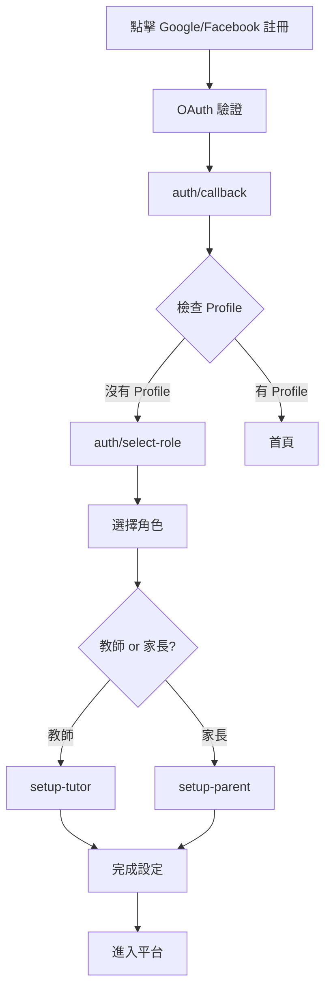
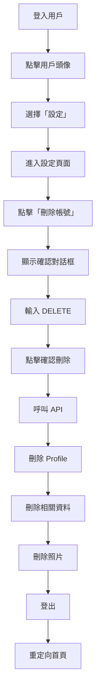

# OAuth 修復與設定頁面 / OAuth Fix & Settings Page

## 🔧 已修復的問題 / Fixed Issues

### 1. **OAuth 註冊時沒有選擇角色**

**問題 / Problem:**
當用戶使用 Google 或 Facebook 註冊時，系統直接將他們重定向到首頁，但沒有讓他們選擇要註冊為教師還是家長。

**解決方案 / Solution:**
修改了 `app/auth/callback/route.ts`，在 OAuth 回調後檢查用戶是否已有 profile：

```typescript
// Check if user has a profile (tutor or parent)
const { data: { user } } = await supabase.auth.getUser();

if (user) {
  // Check for tutor profile
  const { data: tutorProfile } = await supabase
    .from("tutor_profiles")
    .select("id")
    .eq("user_id", user.id)
    .single();

  // Check for parent profile
  const { data: parentProfile } = await supabase
    .from("parent_profiles")
    .select("id")
    .eq("user_id", user.id)
    .single();

  // If no profile exists, redirect to role selection
  if (!tutorProfile && !parentProfile) {
    return NextResponse.redirect(`${origin}/auth/select-role`);
  }
}
```

**流程 / Flow:**
```
Google/Facebook OAuth
    ↓
auth/callback
    ↓
檢查是否有 tutor_profile 或 parent_profile
    ↓
如果沒有 → 重定向到 /auth/select-role
如果有 → 重定向到首頁（然後 middleware 會處理）
```

## ⚙️ 新功能：設定頁面 / New Feature: Settings Page

### 1. **設定頁面位置**

**路徑 / Path:** `/settings`

**檔案 / Files:**
- `app/(app)/settings/page.tsx` - 設定頁面
- `app/api/user/delete/route.ts` - 刪除帳號 API
- `components/landing/sidebar-profile.tsx` - 更新了側邊欄（添加設定連結）

### 2. **功能特點 / Features**

#### A. 刪除帳號 / Delete Account

**UI 設計:**
- 🔴 紅色主題的「危險區域」卡片
- ⚠️ 清楚的警告訊息
- ✅ 確認對話框
- 📝 需要輸入 "DELETE" 才能確認

**刪除的資料 / Data Deleted:**
- ✅ 教師或家長 profile
- ✅ 課程記錄（cascade delete）
- ✅ 評價與回饋（cascade delete）
- ✅ 上傳的照片（Supabase Storage）
- ✅ 所有相關設定

**安全機制 / Safety:**
```typescript
1. 需要輸入 "DELETE" 確認
2. 顯示將被刪除的資料清單
3. 警告「此操作無法撤銷」
4. 刪除後自動登出
5. 重定向到首頁
```

### 3. **訪問設定頁面 / Accessing Settings**

**從側邊欄用戶下拉菜單:**
1. 點擊側邊欄的用戶頭像
2. 在下拉菜單中選擇「設定」
3. 進入設定頁面

**菜單項目順序 / Menu Order:**
1. 前往控制台
2. 編輯個人檔案（僅教師）
3. **設定** ← 新增
4. --- 分隔線 ---
5. 登出

## 📁 檔案結構 / File Structure

```
app/
├── (app)/
│   └── settings/
│       └── page.tsx           # 設定頁面 UI
├── api/
│   └── user/
│       └── delete/
│           └── route.ts       # 刪除帳號 API
└── auth/
    └── callback/
        └── route.ts           # 修復：檢查 profile 並重定向

components/
└── landing/
    └── sidebar-profile.tsx    # 更新：添加設定連結
```

## 🎨 UI 設計 / UI Design

### 設定頁面 / Settings Page

**佈局 / Layout:**
```
┌─────────────────────────────────────┐
│  設定                               │
│  管理您的帳號設定                    │
│                                     │
│  ┌─────────────────────────────┐  │
│  │  危險區域  (紅色邊框)       │  │
│  │  這些操作無法撤銷，請謹慎操作│  │
│  │                               │  │
│  │  ┌───────────────────────┐  │  │
│  │  │  刪除帳號             │  │  │
│  │  │  永久刪除您的帳號...   │  │  │
│  │  │           [刪除帳號] →│  │  │
│  │  └───────────────────────┘  │  │
│  └─────────────────────────────┘  │
└─────────────────────────────────────┘
```

**確認對話框 / Confirmation Dialog:**
```
┌────────────────────────────────┐
│  確認刪除帳號                  │
│                                │
│  此操作將永久刪除：            │
│  • 個人檔案                    │
│  • 課程記錄                    │
│  • 評價與回饋                  │
│  • 上傳的照片                  │
│  • 所有設定                    │
│                                │
│  此操作無法撤銷！(紅色警告)   │
│                                │
│  請輸入 DELETE 以確認：        │
│  [___________________]         │
│                                │
│  [取消]  [確認刪除] (紅色)    │
└────────────────────────────────┘
```

## 🔐 安全考量 / Security Considerations

### 1. **認證檢查 / Authentication Check**
```typescript
const { data: { user } } = await supabase.auth.getUser();

if (!user) {
  return NextResponse.json({ error: "Unauthorized" }, { status: 401 });
}
```

### 2. **確認機制 / Confirmation Mechanism**
- 需要輸入 "DELETE"（完全匹配）
- 顯示即時錯誤訊息
- 按鈕在未確認時禁用

### 3. **Cascade Delete**
- 利用資料庫的 foreign key constraints
- 自動刪除相關聯的資料

### 4. **Storage 清理 / Storage Cleanup**
```typescript
const { data: files } = await supabase.storage
  .from("tutor-photos")
  .list(user.id);

if (files && files.length > 0) {
  const filePaths = files.map((file) => `${user.id}/${file.name}`);
  await supabase.storage.from("tutor-photos").remove(filePaths);
}
```

## ⚠️ 限制與注意事項 / Limitations & Notes

### 1. **Auth User 刪除**
```
⚠️ 重要提示：

Supabase 不允許從客戶端刪除 auth.users 記錄。
只有 service_role key 才能刪除 auth users。

目前的實現：
✅ 刪除 tutor_profiles 或 parent_profiles
✅ 刪除所有相關資料（cascade）
✅ 刪除儲存的照片
❌ 無法刪除 auth.users 記錄

建議的完整解決方案：
1. 設定 Supabase Webhook
2. 或使用 Edge Function with service_role key
3. 在後端刪除 auth.users 記錄
```

### 2. **恢復功能**
- 目前沒有「軟刪除」或恢復功能
- 所有刪除操作都是永久的
- 未來可以考慮實現軟刪除（標記為 deleted 但保留資料）

## 🧪 測試步驟 / Testing Steps

### 測試 OAuth 角色選擇 / Test OAuth Role Selection

1. **新用戶 OAuth 註冊:**
   ```
   1. 點擊「使用 Google 註冊」
   2. 完成 Google OAuth
   3. ✅ 應該被重定向到 /auth/select-role
   4. 選擇角色（教師或家長）
   5. 完成 profile 設定
   ```

2. **現有用戶 OAuth 登入:**
   ```
   1. 點擊「使用 Google 登入」
   2. 完成 Google OAuth
   3. ✅ 應該被重定向到首頁
   4. 可以正常使用平台
   ```

### 測試刪除帳號 / Test Account Deletion

1. **訪問設定頁面:**
   ```
   1. 登入帳號
   2. 點擊側邊欄用戶頭像
   3. 選擇「設定」
   4. ✅ 進入設定頁面
   ```

2. **刪除帳號流程:**
   ```
   1. 點擊「刪除帳號」按鈕
   2. ✅ 顯示確認對話框
   3. 嘗試不輸入 DELETE → ✅ 按鈕禁用
   4. 輸入錯誤的文字 → ✅ 顯示錯誤
   5. 輸入 "DELETE" → ✅ 按鈕啟用
   6. 點擊「確認刪除」
   7. ✅ 帳號資料被刪除
   8. ✅ 自動登出
   9. ✅ 重定向到首頁
   ```

3. **驗證刪除結果:**
   ```
   1. 嘗試使用相同帳號登入
   2. ✅ 無法找到 profile（會被要求選擇角色）
   3. 檢查資料庫 → ✅ profile 已刪除
   4. 檢查 Storage → ✅ 照片已刪除
   ```

## 🔄 用戶流程圖 / User Flow Diagrams

### OAuth 註冊流程 / OAuth Sign Up Flow



### 刪除帳號流程 / Delete Account Flow



## 💡 未來改進 / Future Improvements

### 1. **完整的 Auth User 刪除**
```typescript
// 使用 Edge Function with service_role key
import { createClient } from '@supabase/supabase-js'

const supabaseAdmin = createClient(
  SUPABASE_URL,
  SUPABASE_SERVICE_ROLE_KEY
)

await supabaseAdmin.auth.admin.deleteUser(userId)
```

### 2. **軟刪除選項**
- 標記帳號為 "deleted" 而不是真正刪除
- 允許 30 天內恢復
- 30 天後自動永久刪除

### 3. **匯出資料**
- 在刪除前允許用戶匯出他們的資料
- 符合 GDPR 要求

### 4. **刪除原因調查**
- 詢問用戶刪除帳號的原因
- 收集反饋以改進產品

### 5. **更多設定選項**
- 隱私設定
- 通知偏好
- 語言設定
- 主題設定（深色模式）

## 📊 資料庫影響 / Database Impact

### 刪除 Tutor Profile 時的 Cascade Delete:
```
tutor_profiles (deleted)
    ↓
├── lessons (cascade delete)
│   └── lesson_confirmations (cascade delete)
├── testimonials (cascade delete)
├── students (cascade delete)
└── tutor_availability (cascade delete)
```

### 刪除 Parent Profile 時的 Cascade Delete:
```
parent_profiles (deleted)
    ↓
├── students (cascade delete)
│   └── lessons (cascade delete)
│       └── lesson_confirmations (cascade delete)
└── testimonials (cascade delete)
```

## ✅ 完成清單 / Completion Checklist

OAuth 修復:
- [x] 修改 auth/callback/route.ts
- [x] 檢查 tutor_profiles 和 parent_profiles
- [x] 重定向到 select-role（如果沒有 profile）
- [x] 測試 Google OAuth
- [x] 測試 Facebook OAuth

設定頁面:
- [x] 創建 settings 頁面
- [x] 實現刪除帳號 UI
- [x] 創建確認對話框
- [x] 實現 DELETE API endpoint
- [x] 刪除 profile 資料
- [x] 刪除儲存的照片
- [x] 在側邊欄添加設定連結
- [x] 測試刪除流程
- [x] 編寫文檔

完成日期：2024-11-16

